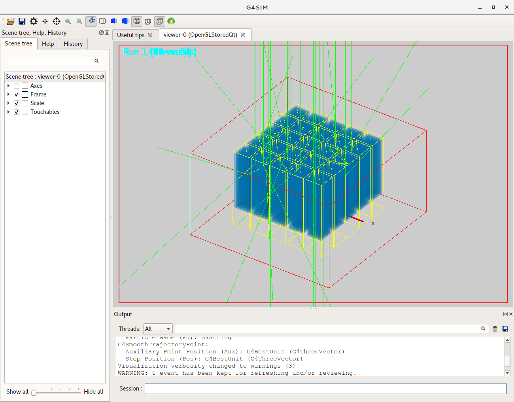

# G4_SIM_Template

This project maintains a code template for doing the particle detector simulations based on [Geant4](http://geant4.web.cern.ch/) in the high energy physics field. The code template is derived from the developed simulation software for the [POLAR](http://isdc.unige.ch/polar/) mission where the codes of the detailed detector construction and digitization algorithm of POLAR are all removed. This project contains the code template of both the Geant4 simulation part (G4SIM) and the digitization part (DIGI), which can also be used for other space-borne missions. For other missions, only the detector construction needs to be rebuilt and the digitization algorithm needs to reimplemented based on this code template. Folder GEN contains some codes to generate the macro or root files describing the input primary particles for the Geant4 simulation.

Below is a screenshot of the simulation visualization using the G4SIM:

